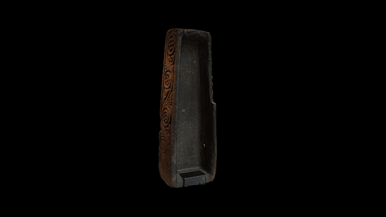

 

# A 3D representation of the Sheffield Cross
3D data for recreation of the Sheffield Cross, a British Museum object in Gallery 41.

The Sheffield Cross Shaft is a sandstone Anglo-Saxon cross-shaft dating to the early ninth century AD. The back of the cross-shaft has been hollowed out at a later period.

Decorated free-standing stone crosses played an important part in the Anglo-Saxon Christian church. The iconographic scheme of this example carries stylized vine scroll decoration which, in Late Antique and Early Medieval Christian tradition, symbolized Christ as the 'True Vine' (Saint John's Gospel 15: 1-7). The main surviving face also bears a vine, its branches drooping with heavy fruit, and in which an archer is concealed as he stalks his quarry. Like other similar representations in Anglo-Saxon art, he is probably intended as an image of the Divine Word, seeking its target. Hunting by archery was important in Anglo-Saxon culture, both as an aristocratic sport and as a source of food.

# LICENSE
The contents of this repository are licensed under CC-BY-NC-SA

# Credits
Photographs by Mary Chester-Kadwell, processing and models by Daniel Pett <dpett@britishmuseum.org>, Digital Humanities Lead, British Museum and Mary Chester-Kadwell <mchester-kadwell@britishmuseum.org>

#Processing
Created by Mary Chester-Kadwell from 90 images taken with a Sony A6000 and assembled in Photoscan Pro.
